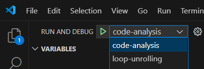
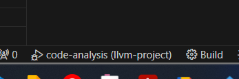

# Disclaimer
Because I didn't have much time, I generated `LoopUnrolling.cpp` and `CodeAnalysis.cpp` using ChatGPT. I have just learned some basic knowledge of LLVM and CMake. I will learn more about how to write LibTool when I have time.

# New added files
[clang-tools-extra/loop-unrolling/LoopUnrolling.cpp](clang-tools-extra/loop-unrolling/LoopUnrolling.cpp)  
[clang-tools-extra/loop-unrolling/CMakeLists.txt](clang-tools-extra/loop-unrolling/CMakeLists.txt)  

[clang-tools-extra/code-analysis/CMakeLists.txt](clang-tools-extra/code-analysis/CMakeLists.txt)  
[clang-tools-extra/code-analysis/CodeAnalysis.cpp](clang-tools-extra/code-analysis/CodeAnalysis.cpp)

# Modified file
I added the follow codes into [clang-tools-extra/CMakeLists.txt](clang-tools-extra/CMakeLists.txt)
``` cmake
add_subdirectory(loop-unrolling) 
add_subdirectory(code-analysis) 
```
# Usage

Just download the repo into your compuer and use VSCode to open it, in the debug panel:
1. Select `code-analysis` to analysis any cpp file(it will analysis [NPB/CG/cg.cpp](NPB/CG/cg.cpp) by default), the analysis result will display on terminal.
2. Select `loop-unrolling` for unroll for-loop inside specific cpp file(it will handle [NPB/CG/example.cpp](NPB/CG/example.cpp) by default). It will output a file for a path you can specific  


# Others
1. It's a good practice to create a build directory at the root of this repository and build everything inside the build folder instead of using `~/llvm` for building. The `~/llvm` directory should be used for installation(`make install`) , where it can accommodate the `bin` (binary files), `include` (header files, such as `.h` or `.hpp`), `lib` (shared libraries, such as `.so`), `libexec`, and `share` directories.  
2. I have created [.vscode/launch.json](.vscode/launch.json) to facilitate quick reproduction.   
3. I have created [.vscode/settings.json](.vscode/settings.json) to enable VSCode’s smart build feature, since the CMakeLists.txt location (`${workspaceFolder}/llvm`) is specified in `settings.json`.  So I just need to build using command `make` every time, I can just click the `build` button in the statebar of VSCode to build llvm.  

4. I have created [.vscode/tasks.json](.vscode/tasks.json) to enable VSCode automaticlly build llvm before starting debug.  
